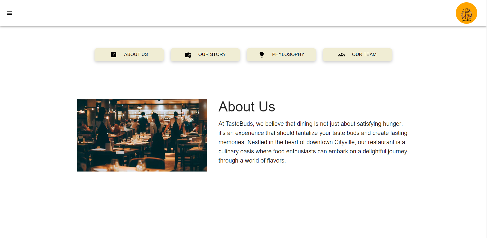

# Getting Started
<details closed>
<summary style="font-size:16px">How to Install and Run the Project?  <span style="font-size:34px">⚙️</span></summary>
<ol>
<li>Start by cloning this repository to your local machine using the following command: <br>

 ### `git clone https://github.com/EmilStanchev/Taste-Buds` </li>
<li>Install Dependencies: Install the necessary dependencies by running: <br>

### `npm install`</li>
<li>Start Development Server: Launch the development server with the following command: <br>

### `npm start`</li>
</ol>
<p>The development server will automatically open a new browser window with the running application. Any changes you make to the code will be hot-reloaded, allowing you to see the updates in real-time.

Now you have the Restaurant Website React Template running locally on your machine! You can start customizing the content, adding images, and tweaking the design to match your restaurant's style.</p>
</details>

# Overview
<p>The Restaurant Website React Template offers a dynamic and engaging solution for creating a captivating online presence for your restaurant. With a seamless integration of Material UI components and a focus on responsive design, this template empowers you to showcase your culinary offerings and connect with customers in a visually appealing and user-friendly way.</p>

<details closed>
<summary style="font-size:16px">Key Features:  <span style="font-size:34px">⚙️</span></summary>
<ol>
<li><strong>Responsive Design:</strong> The template's layout and components are optimized to ensure your website looks stunning on various devices, from smartphones to tablets and desktops.</li>

<li><strong>Material UI Integration:</strong> Leveraging the power of Material UI, the template provides a sleek and modern design, following the principles of Material Design for a consistent and delightful user experience.</li>

<li><strong>Different Themes:</strong> Enjoy the flexibility of different themes for your website. Choose between a light and a dark theme to match your restaurant's aesthetic and create a unique atmosphere online.</li>

<li><strong>Interactive Menu Display:</strong> The template offers a comprehensive structure to display your restaurant's menu items in various categories. This makes it convenient for visitors to explore and choose their desired dishes.</li>

<li><strong>Effortless Reservations:</strong> Simplify the reservation process with an integrated reservation system. Customers can easily reserve a table online by providing their details and preferences.</li>
<li><strong>Prominent Contact Information:</strong> Ensure customers can quickly reach out by prominently displaying your restaurant's contact details, including address, phone number, and email.</li>

<li><strong>About Us Story:</strong> Tell your restaurant's story and introduce the dedicated team behind the scenes. Connect with customers by sharing your passion for food and the unique qualities that set your restaurant apart.</li>

<li><strong>Team Members:</strong> Highlight the individuals who make your restaurant special. Create a section to introduce your talented chefs, friendly waitstaff, and other team members who contribute to the exceptional dining experience.</li>
</ol>
</details>

# Documentation 
Welcome to the documentation for the Restaurant Website React Template. This section provides guidance on integrating external services and setting up essential features.

### Table of Contents

- [API Integration](#api-integration)
- [Firebase Integration](#firebase-integration)
- [Contact Form Setup](#contact-form-setup)

---
<details closed>
<summary id="api-integration" style="font-size:20px">API Integration</summary>

This template integrates with the Edamam API to dynamically fetch and display food menu items. To set up the API integration, follow these steps:

1. **Obtain Edamam API Credentials:**
   - Visit the [Edamam Developer Portal](https://developer.edamam.com/) and sign up for an account if you haven't already.
   - Create a new application to obtain your API key and App ID.
2. **Create `.env` File:**
   - In the root directory of the project, create a `.env` file.
   - Add your Edamam API credentials to the `.env` file:
     ```
     REACT_APP_API_ID=your-app-id
     RREACT_APP_API_KEY=your-api-key
     ```
</details>

<details closed>
<summary id="firebase-integration" style="font-size:20px">Firebase Integration</summary>
Firebase is used to store menu items and reservations. Follow these steps to set up Firebase integration:


1. **Set Up Firebase Project:**
   - Go to the [Firebase Console](https://console.firebase.google.com/) and create a new project if you don't have one.
2. **Configure Firebase in Project:**
   - Locate the `firebase.jsx` file in the `src/config` folder of your project.
   - Replace the existing content with the Firebase configuration code provided by Firebase:
     ```javascript
     // src/config/firebase.jsx
     import firebase from 'firebase/app';
     import 'firebase/firestore';

     const firebaseConfig = {
       apiKey: 'your-api-key',
       authDomain: 'your-auth-domain',
       projectId: 'your-project-id',
       storageBucket: 'your-storage-bucket',
       messagingSenderId: 'your-messaging-sender-id',
       appId: 'your-app-id',
     };

     const firebaseApp = firebase.initializeApp(firebaseConfig);
     const db = firebaseApp.getFirestore();

     export default db;
     ```
3. **Update Collection Names:**
   - Open the `FoodContext.jsx` file located in the `src/utils` folder.
   - Find the lines where the collection names are defined:
     ```javascript
     // src/utils/FoodContext.jsx
     const foodsCollectionRef = collection(db, "foods");
     const clientsCollectionRef = collection(db, "clients");
     const tablesCollectionRef = collection(db, "tables");
     const reservationsCollectionRef = collection(db, "reservations");

     ```
   - Replace `'foods'`,`'clients'`,`'tables'` and `'reservations'` with the desired names for your Firebase collections.

By following these steps, you'll have integrated Firebase to store menu items and reservations for your Restaurant Website React Template. Make sure to replace the placeholder values in the `firebaseConfig` object with your actual Firebase configuration details.

Feel free to refer to the official [Firebase Documentation](https://firebase.google.com/docs) for more detailed information and assistance.
</details>

<details closed>
<summary id="contact-form-setup" style="font-size:20px">Contact Form Setup</summary>
To set up the contact form and integrate it with EmailJS, follow these steps:

1. **Sign Up for EmailJS:**
   - Visit [EmailJS](https://www.emailjs.com/) and create an account.
   - Set up an email template to use for sending contact form submissions.
2. **Add Credentials to `.env` File:**
   - Open the existing `.env` file in the root directory of the project..
   - Add your EmailJS credentials to the `.env` file:
     ```
     REACT_APP_EMAILJS_USER_ID=your-user-id
     REACT_APP_EMAILJS_TEMPLATE_ID=your-template-id
     REACT_APP_EMAILJS_SERVICE_ID=your-service-id
     ```

   Replace `your-user-id`, `your-template-id`, and `your-service-id` with the corresponding values from your EmailJS account.
By following these steps, you'll have set up the contact form to work with EmailJS in your Restaurant Website React Template. Make sure to replace the placeholders with your actual EmailJS credentials.

Feel free to refer to the official [EmailJS Documentation](https://www.emailjs.com/docs/) for more detailed information and assistance.
</details>

# Screenshots

<details closed>
<summary style="font-size:20px">Home page</summary>


</details>
<details closed>
<summary style="font-size:20px">Menu page</summary>


</details>
<details closed>
<summary style="font-size:20px">Reservation page</summary>


</details>

<details closed>
<summary style="font-size:20px">About us page</summary>



</details>

<details closed>
<summary style="font-size:20px">Contact page</summary>

</details>

